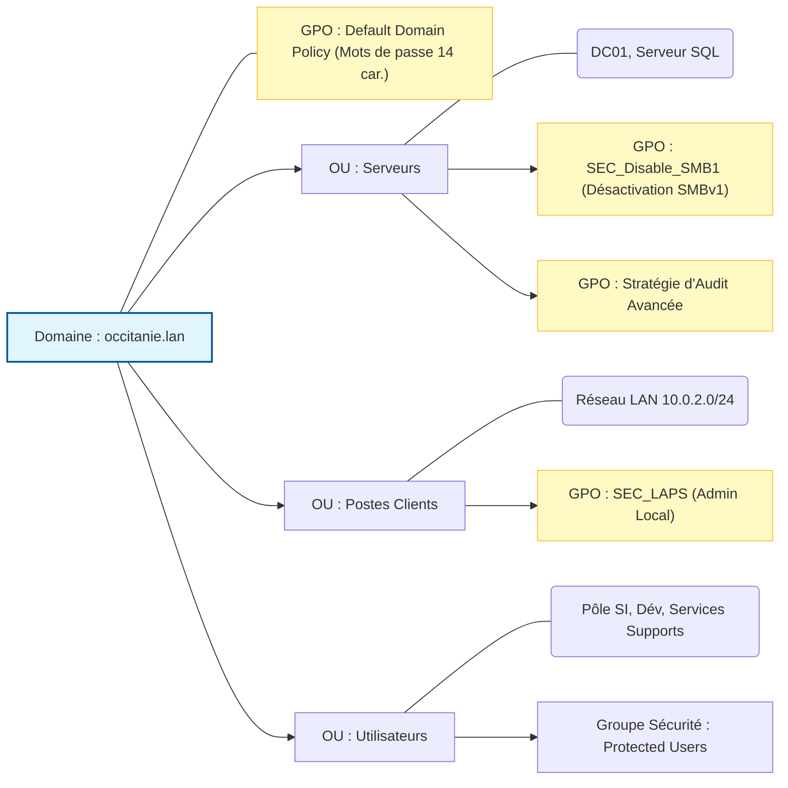

# Déploiement AD DS Windows Server 2019

> [!NOTE] 
> **Contexte**
> 
> Ce document détaille l'architecture logique de l'annuaire Active Directory (AD DS) déployé sur Windows Server 2019. Cette infrastructure sert de socle au réseau d'entreprise simulé dans le cadre de la certification. L'installation a été pensée dès le départ pour faciliter la ségrégation des objets (Serveurs, Postes, Utilisateurs) et l'application granulaire des stratégies de groupe (GPO) de sécurité.

| Rôle | Nom d'hôte | IP (Statique) | Nom de Domaine |
| :--- | :--- | :--- | :--- |
| Contrôleur de Domaine (DC01) | WIN-479952UTUH2 | 10.0.2.10 | occitanie.lan |
| Serveur de Bases de Données | Serveur SQL | (LAN) | occitanie.lan |

## 1. Prérequis et Configuration Initiale

Avant la promotion du serveur en contrôleur de domaine, les configurations systèmes suivantes ont été appliquées pour garantir la stabilité de l'annuaire :

- **Adressage IP statique :** Configuration de la carte réseau avec l'IP `10.0.2.10`.

- **DNS local :** Le serveur pointe vers lui-même (`127.0.0.1`) pour la résolution DNS primaire.

- **Nommage standardisé :** Renommage de la machine en `WIN-479952UTUH2` (rôle DC01) avant la promotion du domaine.

## 2. Structure Logique : Unités d'Organisation (OU)

Afin d'appliquer le principe de moindre privilège et de préparer les remédiations de sécurité, l'arborescence par défaut a été remplacée par une structure personnalisée en Unités d'Organisation (OU).

**Avantages Sécurité de cette architecture :**

1. **Ciblage GPO précis :** Il est possible d'appliquer une stratégie de sécurité très stricte (ex: blocage SMBv1) uniquement sur l'OU `Serveurs`, ou de déployer la rotation de mots de passe locaux (LAPS) uniquement sur l'OU `Postes Clients`.
2. **Isolement des privilèges :** Les utilisateurs standards, les équipes métiers (Développement) et le pôle SI sont séparés, ce qui permet de lier des stratégies de restrictions spécifiques sans impacter les administrateurs globaux (membres du groupe `Protected Users`).

