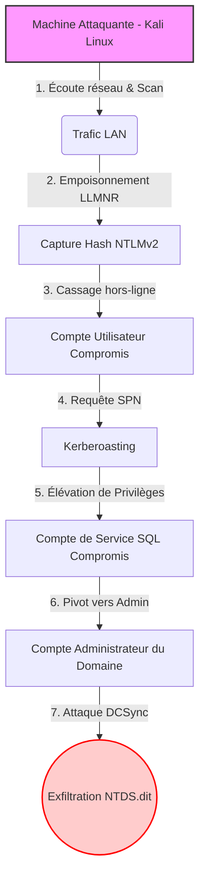

# Méthodologie PTES et Environnement

> [!NOTE]
> **Stratégie d'Audit**
> 
> Pour évaluer efficacement la sécurité de l'infrastructure, l'audit a été structuré autour du standard industriel PTES (Penetration Testing Execution Standard). L'objectif est de simuler le comportement d'un véritable attaquant pour éprouver les défenses mises en place.

## 1. L'Approche "Black-Box"

L'audit a été mené selon une approche dite "Black-Box" (boîte noire).

Cela signifie qu'aucune information préalable (schéma réseau, identifiants, configurations) n'a été fournie avant le début des tests.
Cette posture permet de simuler de manière réaliste une intrusion depuis le réseau local (LAN), en évaluant la capacité du système à résister à un attaquant ne disposant d'aucun privilège initial.

## 2. La Méthodologie PTES (Kill Chain)

Les opérations ont suivi les phases chronologiques suivantes, calquées sur la "Cyber Kill Chain":

1.**Reconnaissance et Scan :** Cartographie du réseau, identification des ports ouverts (Nmap) et détection des services exposés.
2.**Accès Initial :** Écoute du réseau et empoisonnement de flux (LLMNR/NBT-NS via Responder) pour capturer les premiers identifiants (hashs NTLMv2).
3.**Exploitation (Active Directory) :** Énumération des objets AD et exploitation des vulnérabilités du protocole Kerberos (AS-REP Roasting, Kerberoasting).
4.**Post-Exploitation :** Élévation de privilèges jusqu'au niveau "Administrateur du Domaine" et preuve de concept par l'exfiltration de la base des secrets `NTDS.dit` (DCSync).

## 3. Environnement de Laboratoire (Scope)

> [!IMPORTANT]
> **Sécurité de la Production**
> 
> Afin de ne faire courir aucun risque (comme un Déni de Service) à l'infrastructure de production réelle d'Occitanie-IT, l'intégralité du test d'intrusion a été réalisée sur un environnement de laboratoire isolé et virtualisé, reproduisant fidèlement l'architecture cible.

### Cartographie des machines

| Rôle                        | Système d'Exploitation | Adresse IP     | Fonction                                                                                                    |
| :-------------------------- | :--------------------- | :------------- | :---------------------------------------------------------------------------------------------------------- |
| **Machine d'Attaque**       | Kali Linux             | `10.0.2.15`    | [cite_start]Poste de l'auditeur, équipé des outils offensifs (Impacket, Responder, Nmap)[cite: 1128, 1298]. |
| **Cible Principale (DC01)** | Windows Server 2019    | `10.0.2.10`    | [cite_start]Contrôleur de Domaine, cible finale de l'intrusion[cite: 1298, 1504].                           |
| **Services de Données**     | SQL Server             | *(Sur le LAN)* | [cite_start]Cible pour l'exploitation Kerberoasting sur les comptes de service[cite: 1298].                 |